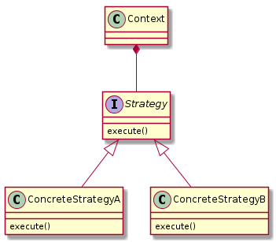

#Strategy Pattern

| Sections ||
| ------- | ---------------- |
| **Pattern Name and Classification**  | A descriptive and unique name that helps in identifying and referring to the pattern. |
| **Intent** | A description of the goal behind the pattern and the reason for using it |
| **Also Known As**| Other names for the pattern.|
| **Motivation (Forces)**| A scenario consisting of a problem and a context in which this pattern can be used.|
| **Applicability**| Situations in which this pattern is usable; the context for the pattern.|
| **Structure**| A graphical representation of the pattern. Class diagrams and Interaction diagrams may be used for this purpose.|
| **Participants**| A listing of the classes and objects used in the pattern and their roles in the design.|
| **Collaboration**| A description of how classes and objects used in the pattern interact with each other.|
| **Consequences**| A description of the results, side effects, and trade offs caused by using the pattern.|
| **Implementation**| A description of an implementation of the pattern; the solution part of the pattern.|
| **Sample Code**| An illustration of how the pattern can be used in a programming language.|
| **Known Uses**| Examples of real usages of the pattern.|
| **Related Patterns**| Other patterns that have some relationship with the pattern; discussion of the differences between the pattern and similar patterns.|
